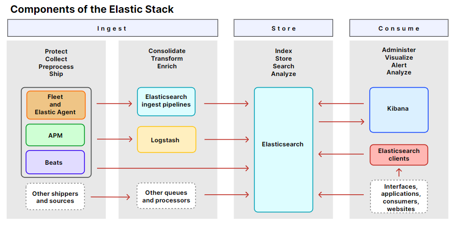

## What is Elastic Stack?

Elastic Stack은 Elasticsearch, Kibana, Beats, Logstash 등을 요소로 해서 안전하게 어떤 곳이든 어떤 포맷이든 매우 많은 양의 데이터를 가져와서 검색, 분석, 시각화할 수 있는 세트입니다

## Components of the Elastic Stack

### Ingest
Elastic은 데이터를 가져오는 수 많은 요소들을 제공하고 있습니다.

#### Fleet and Elastic Agent

Elastic Agent는 호스트가 데이터를 모니터링 하도록 하는 하나의 방법입니다. Elastic Agent는 보안 위협으로부터 호스트를 지키고 운영체제 데이터를 쿼리하고 외부 서비스 혹은 하드웨어의 데이터를 받아 전송합니다. 각각의 Agent는 하나의 정책을 갖고 있어 데이터 소스와 보안 영역 등에서 통합을 이룰 수 있습니다.

Fleet을 이용해 Elastic Agent와 그들의 정책을 한 번에 관리할 수 있습니다.

#### APM
Elastic APM은 Elastic Stack에서 돌아가는 어플리케이션 퍼포먼스 모니터링 시스템입니다. 실시간으로 소프트웨어와 어플리케이션의 상세한 퍼포먼스 정보를 수집하고, 요청에 대한 응답 시간 정보, 데이터베이스 쿼리 시간, 캐시 응답 시간, 외부 HTTP 요청 시간 등을 모니터링합니다. 이를 통해서 퍼포먼스 핵심 문제를 빠르게 수정할 수 있습니다.

#### Beats
Beats는 사용자의 서버에 설치하는 에이전트로 운영 데이터를 Elasticsearch에 보내기 위해 사용합니다. Beats를 이용해서 많은 종류의 데이터 시나리오 (데이터 감사, 로그 파일과 저널, 클라우드 데이터, 가용성, 메트릭, 네트워크 트래픽, 그리고 윈도우 이벤트 로그)를 확인할 수 있습니다.

#### Elasticsearch ingest pipelines

Ingest pipelines는 Elasticsearch에 인덱싱하기 전에 일반적인 변형을 줄 수 있습니다. 하나 혹은 그 이상의 processor 태스크를 순차적으로 실행하도록 설정하여 Elasticsearch에 저장되기 전에 자료에 특정 변형을 줍니다.

#### Logstash

Logstash는 실시간 파이프라인 능력을 갖춘 데이터 모음 엔진입니다. 여러 소스에서 오는 데이터를 정규화 및 통일시켜 원하는 저장소에 저장할 수 있습니다. Logstash는 넓은 범위의 입력과 필터, 그리고 아웃풋 플러그인 그리고 많은 네이티브 코덱을 제공하여 데이터 수집 과정을 단순화합니다.

### Store

#### Elasticsearch

Elasticsearch는 Elastic Stack의 중심부에 있는 분산형 검색, 분석 엔진입니다. 구조화 된 텍스트, 비구조화 된 텍스트, 숫자값, 지리 데이터 모두 Elasticsearch를 통해 효율 적으로 저장하고 빠르게 검색할 수 있도록 인덱싱 됩니다. Elasticsearch는 Elasticsearch에 저장된 데이터에 접근할 수 있는 REST API를 제공합니다.

### Consume

#### Kibana

Kibana는 Elasticsearch 데이터를 이용하는 도구이자 Elastic Stack을 관리하는 도구입니다. Kibana를 이용해 데이터를 분석하고 시각화할 수 있습니다.

#### Elasticsearch clients

Clients는 API 요청과 응답을 관리하는 데 편리한 방법을 제공합니다. 